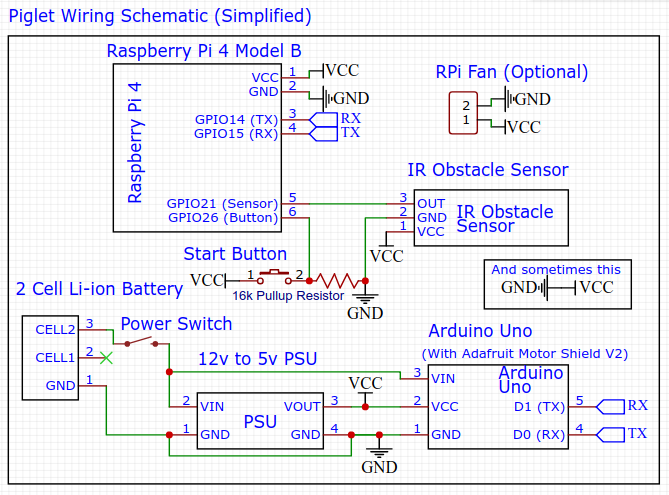

# Everything I use

# The Communication Diagram (TFWRS for short)

# PigS's Schematic (Simplified)

# How To Install

## Install opencv
sudo pip3 install opencv-contrib-python

## Install bluetooth
sudo apt install bluetooth bluez libbluetooth-dev
sudo python3 -m pip install pybluez

## Write 'python3 ~/pystart.py &' to '~/.bashrc'
sudo nano ~/.bashrc

## Stop ttyS0 service
sudo systemctl stop serial-getty@ttyS0.service

## Remove the two pieces related to serial from '/boot/cmdline.txt'
sudo nano /boot/cmdline.txt
